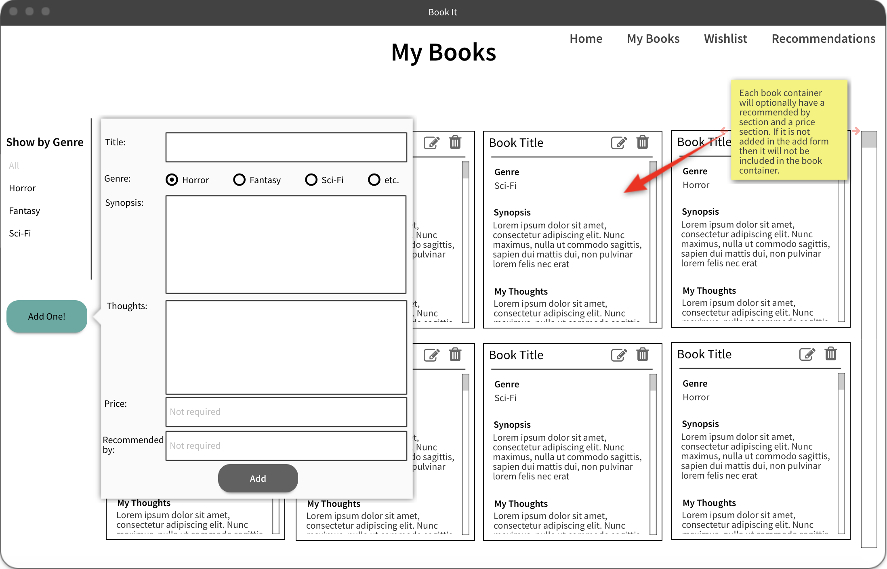

# Proposal

## App Idea/User Story
An app for book worms who have an evergrowing collection of their own and an unmanageable wishlist and list of recommendations. This site will be made to help keep their collections organized. It will have a separate page for each collection (owned, wishlist, recommendations). The user can add books in any of the collections with a title, genre, synopsis, your own thoughts, a price(not required) and a recommended by(also not required). 

### Future Ideas for the App
##### Login
The end goal for the app is to have a user authorization setup so anyone can use the app and store their own books. 
##### Link to search on Amazon
For each book, a button that will take you directly to an Amazon search for that book's title. 

## Wireframe
* *Home Page*
  

* *My Books Page*
  

* *Wishlist Page*
  

* *Recommendations Page*
  

## Mind Map
