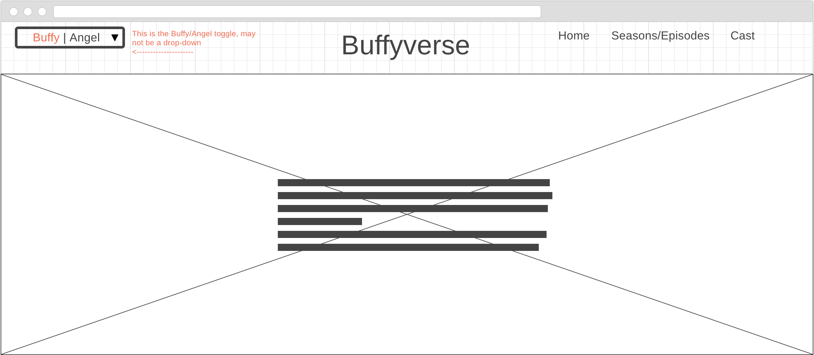
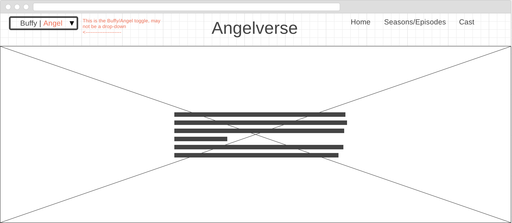
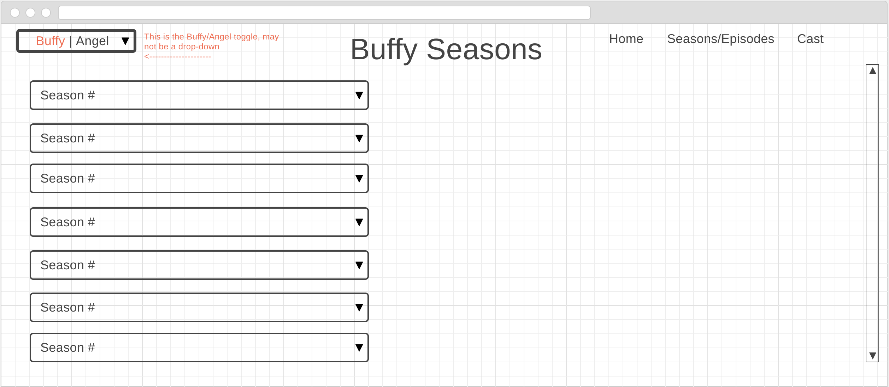
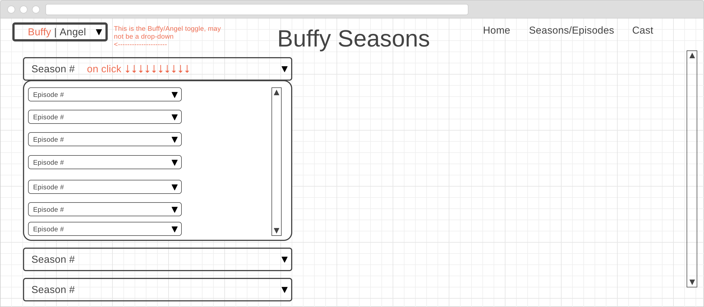
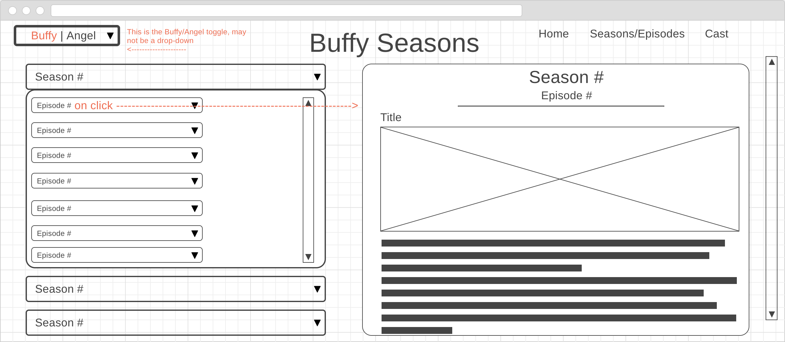
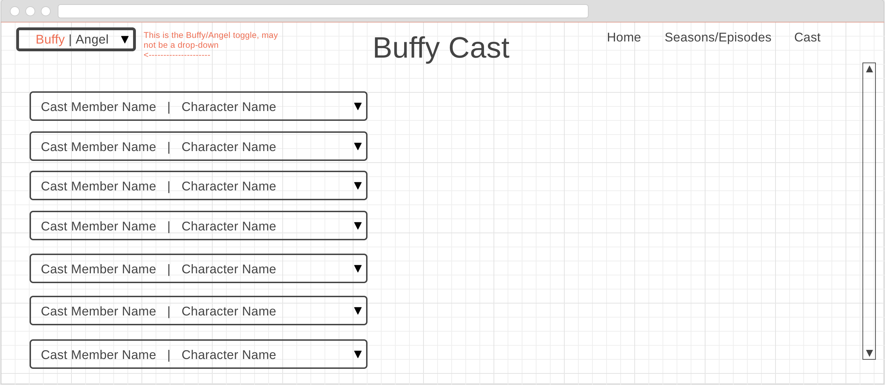
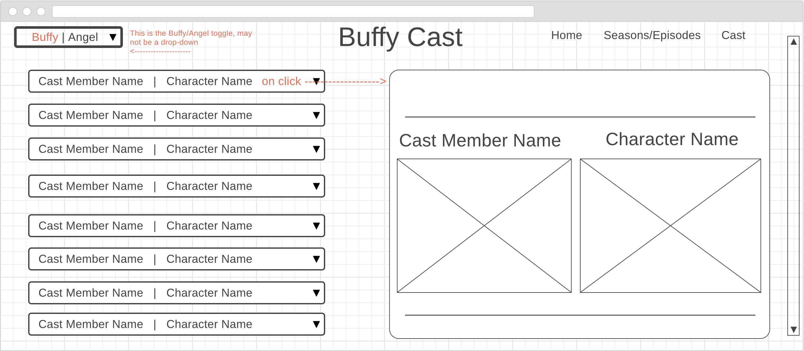
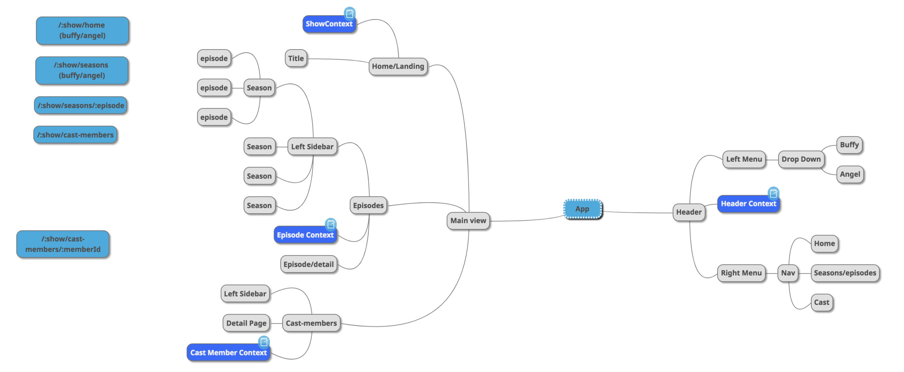

# Proposal

## App Idea/User Story
An app for fans of the Buffyverse/Angelverse. A site where fans can go to find season/episode lists as well as cast member lists for both shows Buffy the Vampire Slayer and Angel. When the user gets to the home page, they will find a simple page with a header, picture and summary of the show. In the header will be links to home, seasons/episodes, and cast as well as a switch to toggle back and forth between a Buffy view and an Angel view. This should persist through different page views. For example, if you toggle to the Angel view on the home page and then click on the seasons/episodes link, it should show the data for Angel. 

### Future Ideas for the App
##### Merch
A Merch page where I can have a few items display from different sellers like Amazon, Ebay, or Etsy with a see more section. Upon clicking, it would take the user to that site's result page for that search where they can purchase all their Buffy/Angel gear.
##### Videos
A Video page where they can see trailers for each season as well as short clips for episodes, etc. 
##### Comics
A Comics page that will display information for all the related Buffy and Angel comics that followed the series'

## Wireframe
* *Home Page*
  * Headers, descriptions, images, etc. will change depending on the toggle
  
  

* *Seasons/Episodes Page*
  * Each season will be a drop down
  * Once the season is clicked on, it will expand to show an episode list
  * Once an episode is clicked on in the list, a section on the right will show details for the specific episode
  * Headers, descriptions, images, etc. will change depending on the toggle
  
  
  

* *Cast Page*
  * Once a cast member is clicked on, a section on the right will show details for that specific cast member
  * Headers, descriptions, images, etc. will change depending on the toggle
  
  

## Mind Map
